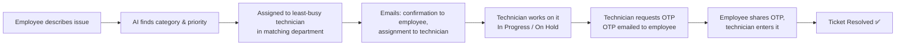

# ThinkAuto — AI-Powered IT Helpdesk

ThinkAuto is a smart IT support system for companies. An employee describes a problem in plain words — on the website or by email — and ThinkAuto automatically creates a ticket, works out what kind of problem it is and how urgent it is, assigns it to the right technician, and keeps everyone informed by email until the problem is solved.

---

## Contents

1. [Why ThinkAuto](#why-thinkauto)
2. [Features](#features)
3. [How It Works](#how-it-works)
4. [User Roles](#user-roles)
5. [Architecture](#architecture)
6. [Tech Stack](#tech-stack)
7. [Project Structure](#project-structure)
8. [Run Locally](#run-locally)
9. [Environment Variables](#environment-variables)
10. [API Reference](#api-reference)
11. [Deployment](#deployment)
12. [Troubleshooting](#troubleshooting)

---

## Why ThinkAuto

In most companies, IT support is slow because someone has to read every request, decide what it is about, and pass it to the right person. ThinkAuto removes that manual step:

| Without ThinkAuto | With ThinkAuto |
|---|---|
| Employee fills a long form and picks categories | Employee just describes the problem |
| Someone reads and sorts each ticket by hand | AI sorts it instantly |
| Tickets pile up on one technician | Work is shared evenly across technicians |
| Employee doesn't know what's happening | Email updates at every step |
| Tickets get "closed" without the problem being fixed | Ticket closes only when the employee confirms with an OTP |

---

## Features

- **Two ways to raise a ticket** — from the Employee panel, or by sending an email.
- **AI classification** — a machine-learning model reads the issue and picks the category (Network, Hardware, Software, Access, Security, Gmail, or Others).
- **Automatic priority** — Low, Medium, High or Critical, based on urgency words like "urgent", "down", "not working".
- **Smart routing** — the ticket goes to a technician from the matching department who has the fewest open tickets.
- **Email notifications** — confirmation to the employee, assignment notice to the technician, and a verification OTP when work is done.
- **OTP-verified closing** — a technician can mark a ticket Resolved only with the OTP sent to the employee.
- **24-hour SLA** — every ticket must be resolved and verified within 24 hours, or it is marked Unsolved.
- **AI chatbot** — a built-in assistant (powered by Groq) that answers IT questions instantly; conversations are saved in History.
- **Role-based dashboards** — separate views for Employees, Technicians and Admins.
- **Analytics & reports** — charts, SLA monitoring and CSV export for admins.
- **Interactive demo** — the **Watch Demo** button on the home page walks through both ticket flows step by step.
- **Responsive design** — works on mobile, tablet and desktop.

---

## How It Works

### Option 1 — Raise a ticket from the Employee panel

1. Sign up or sign in as an **Employee**.
2. Open **Raise Ticket**, describe the issue, and click **Submit Ticket**.
3. ThinkAuto analyzes, routes and confirms it automatically (see below).

### Option 2 — Raise a ticket by email

1. You must already have an Employee account on ThinkAuto.
2. From the **same email address** you registered with, send an email to **freeuse1606@gmail.com**:
   - **Subject:** must contain `ThinkAuto` — e.g. `ThinkAuto - Laptop not connecting to WiFi`
     (the text after "ThinkAuto" becomes the ticket title)
   - **Body:** describe the problem (at least 10 characters)
3. ThinkAuto checks the inbox about every minute. Emails from unregistered addresses, or without "ThinkAuto" in the subject, are ignored.

### What happens next (both options)



**Ticket statuses**

| Status | Meaning |
|---|---|
| Open | Created and assigned, work not started |
| In Progress | Technician is working on it |
| On Hold | Waiting on something (parts, access, the employee) |
| Resolved | Fixed and confirmed by the employee's OTP |
| Unsolved | Not verified within 24 hours of creation |

Ticket numbers look like `TKT-000123`. The OTP is 6 digits and is valid for 15 minutes.

---

## User Roles

| Role | How to get it | What they can do |
|---|---|---|
| **Employee** | Sign up and choose "Employee" | Raise tickets (panel or email), track them in My Tickets, use the AI chatbot, view chat History, edit profile |
| **Technician** | Sign up and choose "Technician", or created by an Admin | See assigned tickets, update status, request and enter the completion OTP, use the chatbot, set availability |
| **Admin** | Created by the seed script (not available on the sign-up page) | See all tickets, reassign tickets, manage employees and technicians, view analytics, reports and SLA monitor, export data |

> **Important for routing:** a technician's **Department** (set in their Profile, or by an Admin on the Technicians page) should match a ticket category — `Network`, `Hardware`, `Software`, `Access`, `Security`, `Gmail` or `Others`. If no technician matches, the ticket goes to any active technician.

### Pages by role

| Employee | Technician | Admin |
|---|---|---|
| Dashboard | Dashboard | Command Center (dashboard) |
| Raise Ticket | Assigned Tickets | All Tickets |
| My Tickets | Update Status | Assign Tickets |
| History (chatbot logs) | History | Analytics |
| Profile | Profile | Technicians |
| | | Employees |
| | | Reports |
| | | SLA Monitor |
| | | History · Settings · Profile |

---

## Architecture

ThinkAuto has three parts, each running as its own service:

```
                        ┌───────────────────────────┐
   Browser  ──────────► │  Frontend (React)         │   Vercel
                        └─────────────┬─────────────┘
                                      │  REST API (JSON + JWT)
                        ┌─────────────▼─────────────┐
                        │  Backend (Node + Express) │   Render
                        └──┬──────┬──────┬───────┬──┘
                           │      │      │       │
          ┌────────────────▼┐  ┌──▼────┐ │   ┌───▼─────────────┐
          │ ML Service      │  │MongoDB│ │   │ Groq AI         │
          │ (Python, Flask) │  │ Atlas │ │   │ (chatbot)       │
          │ Render          │  └───────┘ │   └─────────────────┘
          └─────────────────┘            │
                              ┌──────────▼──────────┐
                              │ Email               │
                              │ Gmail IMAP (in)     │
                              │ Brevo / SMTP (out)  │
                              └─────────────────────┘
```

| Part | Folder | Job |
|---|---|---|
| **Frontend** | `thinkauto_frontend` | Website: home page, sign-in, dashboards, chatbot |
| **Backend** | `thinkauto_backend` | Accounts, tickets, routing, SLA rules, emails, email-to-ticket listener, chatbot proxy |
| **ML Service** | `ml_services` | Predicts ticket category and priority from the issue text |
| **Database** | MongoDB Atlas | Stores users, tickets and chat logs |

**The AI model:** a TF-IDF + Logistic Regression classifier (scikit-learn) trained on 1,000 sample IT tickets (`synthetic_tickets_1000.csv`, training notebook `Untitled14.ipynb`). It predicts one of six categories; priority comes from keyword rules. If the ML service is unreachable, tickets are still created with category `Others` and a keyword-based priority.

---

## Tech Stack

| Layer | Technologies |
|---|---|
| Frontend | React 18, TypeScript, Vite, Tailwind CSS, shadcn/ui, Framer Motion, React Router, TanStack Query, Recharts |
| Backend | Node.js 22, Express, Mongoose, JWT, bcryptjs, Nodemailer, imap-simple, mailparser |
| ML Service | Python 3.13, Flask, scikit-learn 1.6.1, Gunicorn |
| Database | MongoDB Atlas |
| AI Chatbot | Groq API |
| Email | Gmail (IMAP for incoming tickets), Brevo API or Gmail SMTP (outgoing) |
| Hosting | Vercel (frontend), Render (backend + ML service) |

---

## Project Structure

```
AI_SMARTHELPDESK/
├── thinkauto_frontend/          # React website
│   ├── src/
│   │   ├── pages/               # One file per screen (dashboards, tickets, login…)
│   │   ├── components/          # Shared UI: layout, chatbot, demo walkthrough, shadcn/ui
│   │   ├── contexts/            # Logged-in user state
│   │   ├── lib/api.ts           # All calls to the backend
│   │   └── App.tsx              # Routes and role protection
│   ├── vercel.json              # Vercel build + page-refresh rewrite
│   └── .env.example
│
├── thinkauto_backend/           # Node.js API
│   ├── server.js                # Entry point, CORS, starts email listener
│   ├── config/database.js       # MongoDB connection
│   ├── models/                  # User, Ticket, ChatLog
│   ├── controllers/             # Auth, tickets, users, chatbot logic
│   ├── routes/                  # API endpoints
│   ├── middleware/auth.js       # JWT check + role permissions
│   ├── services/
│   │   ├── emailService.js          # Sends emails (Brevo or SMTP)
│   │   ├── emailTicketService.js    # Reads inbox, turns emails into tickets
│   │   ├── ticketRoutingService.js  # AI analysis + least-busy technician (shared by portal & email)
│   │   └── ticketLifecycleService.js# 24-hour SLA enforcement
│   ├── utils/
│   │   ├── ticketStatus.js          # Status list and SLA rules
│   │   └── frontendUrl.js           # Website URL(s) for CORS and email links
│   ├── scripts/seedAdmin.js     # Creates the admin account
│   └── .env.example
│
├── ml_services/                 # Python ML API
│   ├── app.py                   # /health and /analyze endpoints
│   ├── domain_model.pkl         # Trained model
│   ├── synthetic_tickets_1000.csv
│   ├── Untitled14.ipynb         # Model training notebook
│   └── requirements.txt
│
├── render.yaml                  # One-click Render setup for both backends
└── README.md
```

---

## Run Locally

### Requirements

- **Node.js 22** and npm
- **Python 3.13**
- A **MongoDB Atlas** database (free tier is fine)
- A **Groq API key** (free at console.groq.com) for the chatbot
- A **Gmail account** with IMAP enabled and an **App Password** (Google Account → Security → 2-Step Verification → App passwords)

### 1. ML Service — port 5001

```bash
cd ml_services
python -m venv .venv
.venv\Scripts\activate          # Windows
# source .venv/bin/activate     # macOS / Linux
pip install -r requirements.txt
python app.py
```

Check: open http://localhost:5001/health → `"model_loaded": true`

### 2. Backend — port 5000

```bash
cd thinkauto_backend
npm install
cp .env.example .env            # then fill in your values (see below)
npm run seed                    # creates the admin account (first time only)
npm run dev
```

Check: open http://localhost:5000/api/health → `"success": true`

### 3. Frontend — port 8081

```bash
cd thinkauto_frontend
npm install
cp .env.example .env.local      # VITE_API_URL=http://localhost:5000/api
npm run dev
```

Open http://localhost:8081

### 4. Try it

1. Sign up one **Employee** and one **Technician** (set the technician's Department in Profile, e.g. `Network`).
2. As the Employee, raise a ticket like *"My laptop can't connect to the office WiFi"*.
3. Check the emails, then as the Technician open **Update Status**, request the OTP, and enter it to resolve the ticket.
4. Sign in with the admin email/password from `.env` to see everything.

---

## Environment Variables

### Backend — `thinkauto_backend/.env`

| Variable | Required | Description | Example |
|---|---|---|---|
| `PORT` | Local only | Server port (Render sets it automatically) | `5000` |
| `NODE_ENV` | Yes | `development` or `production` | `production` |
| `MONGODB_URI` | Yes | MongoDB Atlas connection string | `mongodb+srv://…/thinkauto` |
| `JWT_SECRET` | Yes | Long random string for login tokens | — |
| `JWT_EXPIRE` | Yes | How long a login lasts | `7d` |
| `FRONTEND_URL` | Yes | Website URL(s), comma-separated, no trailing slash. Used for CORS and email links | `https://thinkauto.vercel.app` |
| `ML_SERVICE_URL` | Yes | ML service URL, no trailing slash | `http://localhost:5001` |
| `GROQ_API_KEY` | Yes | Key for the AI chatbot | — |
| `BREVO_API_KEY` | Recommended | Sends email through Brevo. When set, it replaces SMTP | — |
| `EMAIL_FROM` | With Brevo | Sender address (must be verified in Brevo) | `freeuse1606@gmail.com` |
| `EMAIL_HOST` / `EMAIL_PORT` / `EMAIL_SECURE` | Without Brevo | SMTP server | `smtp.gmail.com` / `587` / `false` |
| `EMAIL_USER` / `EMAIL_PASS` | Without Brevo | SMTP login (Gmail App Password) | — |
| `IMAP_HOST` / `IMAP_PORT` / `IMAP_TLS` | For email tickets | Inbox server | `imap.gmail.com` / `993` / `true` |
| `IMAP_USER` / `IMAP_PASS` | For email tickets | Inbox login (Gmail App Password) | `freeuse1606@gmail.com` |
| `IMAP_CHECK_INTERVAL` | Optional | How often to check the inbox (ms) | `60000` |
| `ADMIN_EMAIL` / `ADMIN_PASSWORD` | For seeding | Admin account created by `npm run seed` | — |

### Frontend — `thinkauto_frontend/.env.local`

| Variable | Description | Example |
|---|---|---|
| `VITE_API_URL` | Backend API URL (ends with `/api`) | `http://localhost:5000/api` |

### ML Service

| Variable | Description | Example |
|---|---|---|
| `PORT` | Port (Render sets it; local default is 5001) | `5001` |
| `PYTHON_VERSION` | Render only | `3.13.0` |

> Never commit `.env` files — they are already listed in `.gitignore`.

---

## API Reference

Base URL: `http://localhost:5000/api` (local) or `https://<backend>.onrender.com/api` (live).
All endpoints except sign-up, login and health need the header `Authorization: Bearer <token>`.

### Auth — `/api/auth`

| Method | Endpoint | Who | Description |
|---|---|---|---|
| POST | `/signup` | Anyone | Create an Employee or Technician account |
| POST | `/login` | Anyone | Log in and receive a token |
| GET | `/me` | Logged in | Current user's details |
| POST | `/logout` | Logged in | Log out |
| PUT | `/profile` | Logged in | Update username, name, phone, department |
| PUT | `/change-password` | Logged in | Change password |
| PUT | `/availability` | Logged in | Set technician availability |
| DELETE | `/account` | Logged in | Delete own account (not for admins) |

### Tickets — `/api/tickets`

| Method | Endpoint | Who | Description |
|---|---|---|---|
| GET | `/` | Logged in | List tickets (employees see their own, technicians see assigned and unassigned, admins see all) |
| POST | `/` | Logged in | Create a ticket — AI classifies and routes it |
| GET | `/stats` | Admin | Ticket statistics |
| GET | `/:id` | Logged in | One ticket |
| PUT | `/:id` | Technician, Admin | Update a ticket (e.g. status) |
| POST | `/:id/comments` | Logged in | Add a comment |
| PUT | `/:id/assign` | Admin | Assign to a technician |
| POST | `/:id/request-verification` | Technician, Admin | Email the completion OTP to the employee |
| POST | `/:id/verify-completion` | Logged in | Submit the OTP to mark the ticket Resolved |

### Users — `/api/users`

| Method | Endpoint | Who | Description |
|---|---|---|---|
| GET | `/technicians` | Admin, Technician | List technicians |
| GET | `/stats` | Admin | User statistics |
| GET / POST | `/` | Admin | List users / create a user |
| GET / PUT / DELETE | `/:id` | Admin | View / update / delete a user |

### Chatbot — `/api/chat`

| Method | Endpoint | Who | Description |
|---|---|---|---|
| POST | `/message` | Logged in | Send a message to the AI assistant |
| GET | `/logs` | Logged in | Chat history |

### Other

| Method | Endpoint | Description |
|---|---|---|
| GET | `/api/health` | Backend health check |
| GET | `<ML_SERVICE_URL>/health` | ML service health check |
| POST | `<ML_SERVICE_URL>/analyze` | Body `{"issue": "text"}` → category, priority, team, confidence |

---

## Deployment

| Part | Host | Plan |
|---|---|---|
| Frontend | Vercel | Hobby (free) |
| Backend | Render Web Service | Free |
| ML Service | Render Web Service | Free |
| Database | MongoDB Atlas | M0 (free) |

**Before you start:** push the repo to GitHub, and in MongoDB Atlas → Network Access allow `0.0.0.0/0`.

Deploy in this order — each step needs the URL from the previous one.

### 1. ML Service → Render

Render → **New → Web Service** → connect the repo.

| Setting | Value |
|---|---|
| Root Directory | `ml_services` |
| Runtime | Python 3 |
| Build Command | `pip install -r requirements.txt` |
| Start Command | `gunicorn app:app --bind 0.0.0.0:$PORT --workers 1 --timeout 120` |
| Environment | `PYTHON_VERSION` = `3.13.0` |

Check `https://<ml-service>.onrender.com/health` shows `"model_loaded": true`.

### 2. Backend → Render

Render → **New → Web Service** → same repo, same region.

| Setting | Value |
|---|---|
| Root Directory | `thinkauto_backend` |
| Runtime | Node |
| Build Command | `npm install` |
| Start Command | `npm start` |
| Environment | Every variable from your `.env` (except `PORT`), with `NODE_ENV=production` and `ML_SERVICE_URL=https://<ml-service>.onrender.com` |

Check `https://<backend>.onrender.com/api/health`. The logs should show *MongoDB Connected*, *Email service is ready* and *Email listener started*.

> Shortcut: **New → Blueprint** with the included `render.yaml` creates both services at once and asks for the secret values.

### 3. Frontend → Vercel

Vercel → **Add New → Project** → import the repo.

| Setting | Value |
|---|---|
| Root Directory | `thinkauto_frontend` |
| Environment | `VITE_API_URL` = `https://<backend>.onrender.com/api` |

After it deploys, go back to Render and set the backend's **`FRONTEND_URL`** to your Vercel URL.

### 4. Keep the backend awake

Render's free plan sleeps a service after 15 minutes without visits, which also pauses email-to-ticket. Add a free monitor on **UptimeRobot** or **cron-job.org** that opens `https://<backend>.onrender.com/api/health` every 10 minutes.

Don't ping the ML service — the free plan has ~750 hours/month, enough for one always-on service. The ML service wakes on the first ticket (30–60 seconds); open its `/health` URL before a demo.

### 5. Final check

1. Sign up as an Employee and a Technician.
2. Raise a ticket from the panel → confirmation and assignment emails arrive.
3. Email `freeuse1606@gmail.com` with subject `ThinkAuto - test issue` → ticket appears within about a minute.
4. Request the OTP as the technician, enter it → ticket becomes Resolved.

---

## Troubleshooting

| Problem | Solution |
|---|---|
| CORS error in the browser | `FRONTEND_URL` on the backend must exactly match the website URL (https, no trailing slash) |
| Website calls `localhost:5000` after deploying | Add `VITE_API_URL` in Vercel and redeploy (it is built into the site) |
| 404 when refreshing a page on Vercel | Root Directory must be `thinkauto_frontend` so `vercel.json` is used |
| First request takes ~50 seconds | The Render service was asleep — normal on the free plan |
| No emails arrive | Check `BREVO_API_KEY` and that the sender is verified in Brevo; look in spam |
| Email didn't become a ticket | Sender must be a registered **Employee**, subject must contain `ThinkAuto`, and `IMAP_PASS` must be a Gmail App Password |
| Every ticket goes to the same technician or category is `Others` | Set technicians' Department to a category name; check the ML service `/health` |
| ML `/health` shows `model_loaded: false` | `scikit-learn` must be version `1.6.1` (the model was trained with it) |
| Backend stops at start with a MongoDB error | Check `MONGODB_URI` and Atlas Network Access (`0.0.0.0/0`) |
| Can't log in as admin | Run `npm run seed` in `thinkauto_backend` with `ADMIN_EMAIL` / `ADMIN_PASSWORD` set |
